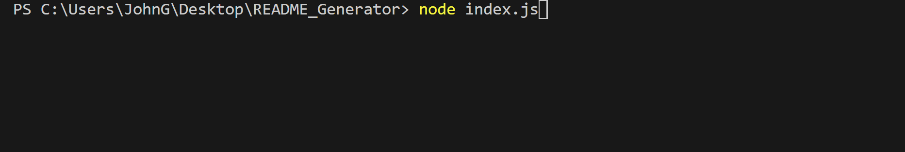
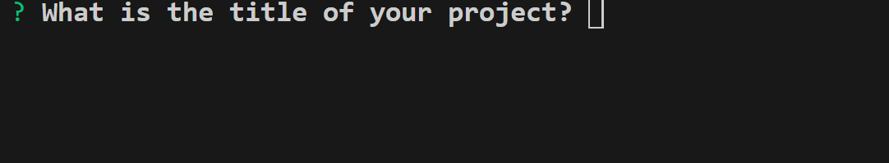
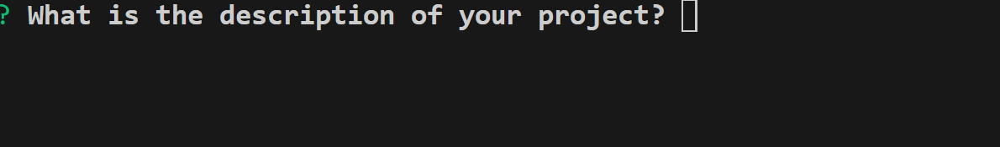
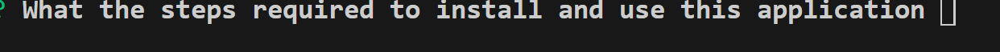
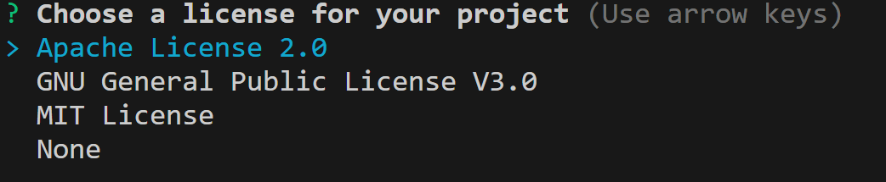
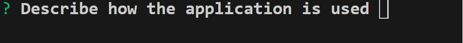
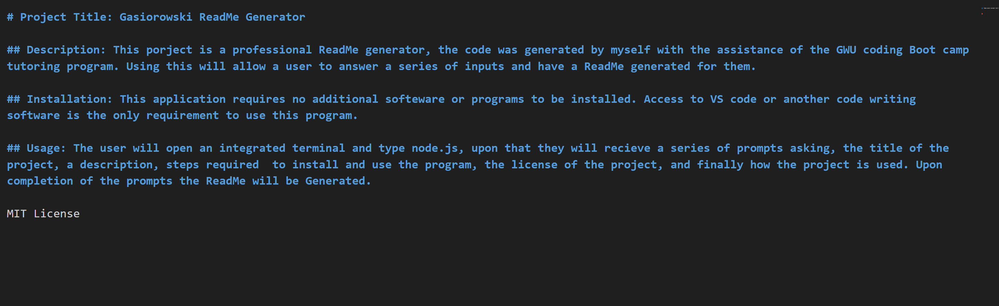

    
# Project Title: Gasiorowski ReadMe Generator

## Description: This porject is a professional ReadMe generator, the code was generated by myself with the assistance of the GWU coding Boot camp tutoring program. Using this will allow a user to answer a series of inputs and have a ReadMe generated for them.

## Installation: This application requires no additional softeware or programs to be installed. Access to VS code or another code writing software is the only requirement to use this program.

## Usage: The user will open an integrated terminal and type node.js

## Upon that they will recieve a series of prompts asking:
### the title of the project,

### A description,

### steps required to install and use the program,

### the license of the project, 

### And finally how the project is used. 

## Upon completion of the prompts the ReadMe will be Generated.

MIT License

    

    
    
    
    
